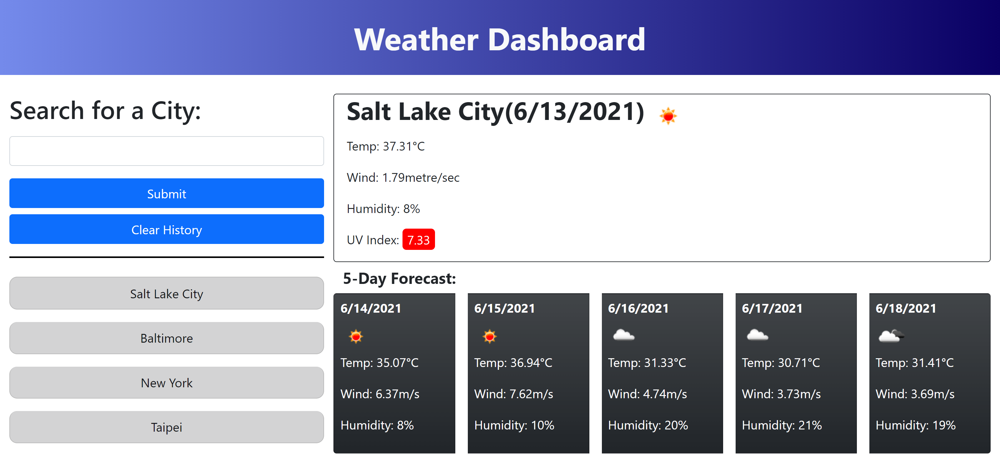

# weather_dashboard-2021
## Description
This project allowed me to use full advantage of web, thirdparty, and serverside APIs to build a fun weather website. The combination of APIs an Jquery ment that I was able to make this website in only a few hours compared to before. The improved efficiency that these tools provide makes them essential to any developers toolkit. Most importantly, I was able to practice the skill of being able to learn how to use new APIs which will allow me to further expand my toolbox in the future. 
## Table of Contents (Optional)
- [Installation](#installation)
- [Usage](#usage)
- [Credits](#credits)
- [License](#license)
## Installation
Deployed link: https://randy-chou.github.io/weather_dashboard-2021/
## Usage
Screenshot:

## Credits
N/A
## License
N/A
## Badges
N/A
## Features
The website allows you to enter city names into a search bar which will then display current and future weather data. If something other than a city name submitted, the website will display an error message and ask you to try again. Your past searches are stored locally and displayed beneath the search bar and can be clicked to retrieve updated weather data for that city. There is also a clear history button that can clear your past searches.
## How to Contribute
N/A
## Tests
N/A